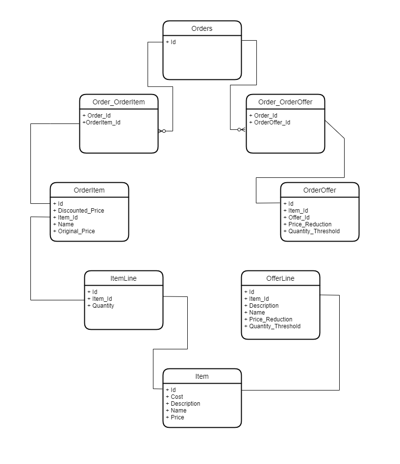

[//]: # (## Trade-offs)

[//]: # (3 September 2022: Now, after implementing `ItemAPI`, `ItemManagementAPI` and `OrderAPI` I have two choices to proceed with the exercise.)

[//]: # ()
[//]: # (Choice 1: Whether I should go start writing Tests for the implemented stuffs completed till date and start building more features like better Error Handling, Validations and Exceptional Handling.)

[//]: # ()
[//]: # (Choice 2: Go on implementing the last part of exercise i.e. `OfferAPI` and `OfferManagementAPI`so I will cover all the User stories and APIs. As )

 

# Public
## Item API
**No Entity created**.
* #### GET
  Uses `ItemManagementRepository` (internal) to query all offers. Maps each `ItemManagementLineEntity` (internal) to `ItemLineModel` (public) and returns `List<ItemLineModel>`

### Master Database

## Order API

### `OrderEnity`

### `OrderItemEnity`

### `OrderOfferEnity`

### `OrderEntity` <--> `OrderItemEntity` (Relationship)

### `OrderEntity` <--> `OrderOfferEntity` (Relationship)

* #### GET
  Accepts `@RequestParam` `List<String> values`. Returns matching `List<OrderEntity>`
* #### POST
  Accepts `@ResquestBody` `List<OrderEntity>`

 

## Offer API
**No Entity created**.
* #### GET
  Uses `OfferManagementRepository` (internal) to query all offers and returns `List<OfferManagementEntity>`

# Internal

## Item Management API
### `ItemManagementLineEntity`

### `ItemManagementItemEntity`

* #### GET
  Returns `List<ItemManagementLineEntity>`
* #### POST
  Accepts `@RequestBody` `List<ItemManagementLineEntity>`
* #### DELETE
  Accepts `@RequestBody` `ItemManagementDeleteModel` -> `List<Integer> itemIds`. Will delete all items with matching `itemIds.get()`

## Offer Management API
### `OfferManagementEntity`

* #### GET
    Returns `List<OfferManagementEntity>`
* #### POST
    Accepts `@ResquestBody` `List<OfferManagementEntity>`
* #### DELETE
    Accepts `@RequestBody` `OfferManagementDeleteModel` -> `List<String> offerIds`

[//]: # (# Trade-offs)

[//]: # ()
[//]: # (## Monolithic over Micro-services)

[//]: # (This is the no.1 trade-off, I felt while moving to finish Public Item API consumer package. The benefit I gained over following a monolithic architecture is that )

[//]: # (I can simply call `itemsManagementRepository.findAll&#40;&#41;` from `ItemsManagementAPI` package which is not a public API consumer package. Calling this method will simply return me a `List<ItemsManagementLineEntity>`. I can)

[//]: # (iterate over this `List`, create new `ItemModel`, call `ItemModel.set&#40;List<ith item>.get&#40;&#41;&#41;` and return `List<ItemModel>` to Public API consumer. This is because both Public and Internal consumers package lies within the same codebase. )
